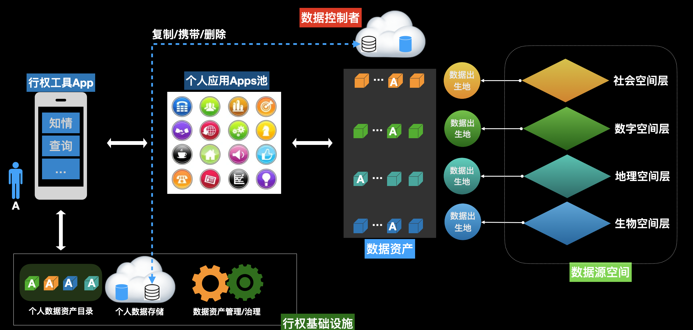

# PeopleData总体架构

## 1. 理念和原则

##### 理念：个人数据开发利用新范式

```markdown
**PeopleData**是个人数据开发利用范式的一个名称。 
**PeopleData**所倡议的核心原则：
- 还数于民
- 用数利民
- 智数惠民

全球个人数据开发利用的范式的“三足鼎立”：
- mydata范式的核心特点是data sovereignty。
- opendata范式的核心特点是market rules和技术协议。
```

##### peopledata包括的主要内容：

- 原则：【12字原则】
- 基础设施：是data layer的一种实现。
- 科技：需要科技来支撑“互操作、可观测、主权、价值创造、治理、ID、计算信任、安全...”
- 生态：基于范式原则，围绕个人数据开发利用的新生态。

**peopledata**是浸入在数字经济中的基础设施，其核心功能是促进个人数据的开发利用。

```json
peopledata是一个基于【peopledata范式原则】构建的个人数据可信、安全流通和分享的分布式基础设施。
```

**peopledata**的总体架构示意图：


**peopledata**生态是有各利益参与方共建、共享的生态。

```markdown
peopledata的主要利益参与方：
- [1] 数据消费者
- [2] 数据提供者
- [3] 数据生产者
- [4] 数据所有着
- [5] 数据应用App提供商
- [6] 数据平台服务商
- [7] 数据市场服务商
- [8] 身份服务商
```

**peopledata** 主要解决的问题是个人数据开放、隐私和安全的“不可能三角”。

```markdown
Data Layer（DL）会在整个数字网络中形成独立的层。
- 数据所有者/控制者：数据生产链
- 数据使用着/消费者：数据供应链
- 数据市场：数据价值链

为便于架构设计，将数据层又独立的分为如下若干子层（sub-layer）：
1. DL0层：数据生产层
2. DL1层：「个人数据资产保护、治理和管理」PDMS -> 个人数据主权基础设施
				- 互操作性/可观测性；
				- 信任；
				- 价值；
				- 治理；
3. DL2层：自治、动态、虚拟和分布式个人数据合作组织 DCO -> 数据资本形成基础设施
				- 隐私保护
				- 安全
				- 经济
4. DL3层：场景应用 -> 价值生态层
```


## 2. 目标

- 范式原则：个人数据开发利用遵循的原则【people data范式】；
- 目标：对个人数据的开发利用，需要始终兼顾开放、隐私和安全，并在这三者之间形成的“不可能三角”中，基于场景（context）寻求最优解决方案。

###  2.1 DL1层

```markwodn
------ DL1层 --------
- 互操作性 interoperability
		[] 数据模型和格式:data mode & doctype
		[] 数据交收协议： delivery protocol/API/ABI 
		[] 数据溯源和数据血缘: Provance/Linage
- 可观测性 obveribility 
		[] logs
		[] 数据处理流程
		[] 设备/虚拟机
		[] 任务调度
- 可信
		[] ID管理
		[] 数据访问权限管控，隐私策略等
		[] 计算信任
- 资产
	 [] 数据资产目录；
	 [] 数据定价和使用计量；
	 [] 数据发布、交收等市场服务
- 治理
	[]  商业模式；
	[]  运营；
	[]  操作规范/标准；
```

#### 2.1.1 互操作性 interoperability 

数据提供者、数据消费者和数据生产者需要遵守的共同标准和协议。

#### 	2.1.1.1 数据模型和格式

数据模型需要满足几个维度的考量：

- 确权：对数据的权利进行确权。
- 溯源：对流通的数据能够追溯到其出生地或可信任源所需要的相关凭证和metadata。
- 品控：能够反映数据质量、数据治理等方面的状态或凭证。
- 权能/鉴权：数据各项权能能够单独或整体设置，并提供鉴证的方法。
- 安全：保护数据安全采取的包括加密等措施。
- 计量：能够依据数据的特性建立计量标准。
- 交易：能够实现数据可控、可存证和可履行的价值交换活动。
- 存储：定义数据存储的方式、位置以及相关的策略。
- 其他：根据数据类别而自定义的其他维度。
一个参考数据模型：《PeopleData个人数据空间模型》。

```markdown
数据分类分级： 按照**分类分级**标准可以划分为17大类，22个小类，以及1-5安全级别。参考《信息安全技术 个人信息安全规范》 GB/T35273 -2020

数据格式（doctype）：1）主要考虑机器可读、自动化处理和数据资产管理；2）满足w3c VCs的标准，可验证的数据格式。例如：JSON-LD。 

*个人数据格式还有待标准化*。
```

#### 	2.1.1.2 数据交收协议

```markdown
数据交收模式：
 - 按照交收参与者分类：1）点对点交收；2）多对壹交收；3）多对多交收；
 - 按照隐私和安全分类：1）数据可用可见交收； 2)数据可用不可见交收；3）可信计算交收等。
```

#### 	2.1.1.3 数据溯源和数据血缘
##### 数据溯源（data provance）

**数据**在整个生存周期内(从产生、传播到消亡)的演变信息和演变处理内容的记录。 **数据溯源**也称为“**数据**族系”、“**数据**系谱”。 ProVOC 模型provenance vocabulary model 定义了一种简便**数据溯源**描述模型。


##### 数据血缘（data linage)

- 数据血缘属于数据治理中的一个概念，是在数据溯源的过程中找到相关数据之间的联系，了解数据是怎么来的，经过了哪些过程和阶段。
- 血缘分析是保证数据融合的一个手段，通过血缘分析实现数据融合处理的可追溯。数据血缘跟踪、记录、展示了数据来自何处，以及在数据流转过程中应用了哪些转换操作，它有助于追溯数据来源及处理过程。
- 数据血缘系统的核心功能：
  	1）数据资产的自动发现及创建
  	2）血缘关系的自动发现及创建
  	3）不同视角的血缘及资产分析展示
  	4）与数据血缘容易混淆的概念：数据起源。数据起源重点在于跟踪数据的原始来源，包括与数据相关的采集、规则、流程，以帮助数据工程师评估数据的质量。

```markdown
# 数据血缘通常有三个视角：
- 数据工程师：通常希望看到数据处理细节的血缘，例如数据处理过程中的mapping，de-duplicate，data masking，merge，join， update, delete, insert等诸如此类的操作，这样便于在数据出现问题的时候方便他们进行回溯分析定位。
- 业务用户：通常希望看到数据从哪里来，经过了那些关键的处理环节，每个处理环节是谁来负责，他们通常不关心诸如merge，join等非常技术细节的操作。
- 数据交易：交易标的的数据资产经过哪些环节，和哪些数据进行了融合，以及什么方式进行的融合等。这样便于了解数据的价值构成。
```

#### 
#### 2.1.2 可观测性/透明度 observability/transparency

对数据从出生、传输、交收和使用的各个处理环节的操作进行监控、可视化的工具和协议。

#### 2.1.3 可信 Trusted

- 身份管理：对于参与各方的身份ID、认证、鉴权、授权等。
- 数据访问和使用控制和策略：对数据访问和使用的控制以及设置不同的策略。
- 可信环境：

#### 2.1.4 资产 Assets

- 数据资产化 - 【非常重要和关键】
- 数据资产目录
- 数据资产计量
- 数据交易清算、结算和市场服务

```markdown
其他辅助技术系统：
- 例如不同系统、协议之间的适配、耦合。
```

#### 2.1.5 治理 Goverance

- 参与方及其之间的关系


- 商业
  - 服务协议SLA
  - 记账/收费
  - 清算/结算
  - 数据目录
  - 数据样本
  - 数据资产评估/估值
  - 智能合约/审计
  - 【数据/算法/算力】质量检测/监测

### 2.2 DL2层

```markdown
------- DL2层 -------
DL2层：自治、动态、虚拟和分布式个人数据合作组织 DCO -> 数据资本形成基础设施
				- 隐私保护
				- 安全
				- 经济
```

DL层需要解决的一个特别重要的问题是：可信的数据、可信的算法、可负担的算力。

对于交易双方而言，产生价值依赖于“数据、算法和算力”的综合作用，缺一不可。这其中有大量的技术以及法律、制度、标准和规范等。

具体实现可能有多种形态。参考架构仅提出一些原则和一个示范性实施实例，并不具体指定和要求。

```markdown
-- datomspod数悦坊 --

一笔业务的步骤描述如下：
- 自然人$\mathcal{A}$ 的个人数据空间记为$\mathbb{D}_{\mathcal{A}}^{p,q}$,其中$p$,$q$ 为类别和安全级别；
- 发起人（赞助人）$\mathcal{S}$ 是发起一项基于个人数据处理业务/需求的主体。
- $\mathcal{S}$ 拟定了一份数据开发利用提案，并通过「数悦坊」审核、验证后，正式发起招募。
- 「数悦坊」是一个中介服务平台，为个人数据合作虚拟组织提供基础安全、可信的计算服务。
- 「数悦坊」得到数量为$N$个自然人的同意后，与$\mathcal{S}$签署“智能合约”$\mathcal{C}$。智能合约详细的规定了算力资源要求、数据格式和规范以及使用期限、收益分配等等条款；
- 「数悦坊」按照合约的要求，创建一个新的，与合约一对一对应的「数悦坊」。
- $N$个自然人的个人数据按照要求被replicated到「数悦坊-123」，发起人（赞助人）$\mathcal{S}$的算法也上传到「数悦坊」。计算完成后，「数悦坊-123」被kill。
- 每个人自然人按照合约规定获得权益或收益。

数据使用主要条款TS：{标准化合约}

- 不能复制和泄漏
- 隐私及权限设置在进入数悦坊前已经审核
- 期限：按合约
- 供给方式：1）批处理；2）Block；3）其他
- 记账/分润：按合约
- 其他条款                                                                
```

### 2.3 DL3层

(不涉及)


## 3. 参考架构 

对具体实现DL1~ DL2层，以及各层之间的接口的架构设计。


## 4. 商业模式

### 4.1 DL1层

DL1层是基础设施，主要是基于个人权能服务构建个人“数据可携带”的基础架构。在次基础上，才能搭建个人数据资产管理等业务。



- 个人数据资产管理（PDMS）

- 个人数据中心（PDC）

  ```markdown
  个人数据中心的形态和结构将会非常多样性。主要有三种：
  - 个人云： 采用NAT等设备构建的个人云。
  - 虚拟个人数据中心：根据个人特性，从现有数据中心基础上设施上，虚拟化的数据中心。
  - 分布式异构数据中心：采用同步、异步混合的方式，与分布在不同场景、地域和实体的数据库之间，按照某种协议互联的数据中心。
  ```

  

### 4.2 DL2层 

个人数据价值发现、生成以及资本形成网络。

- 生产力：支撑高动态、大数据的超算中心/虚拟可信计算环境；
- 生产关系：成员自主的动态聚合、汇聚成新型数据合作组织，通过授权/委托方式，产生价值并分享收益；
- 商业/经济模型：DAO、虚拟合作组织、合作社等
- 治理和监管：主要监管难点是跨境、跨不同的司法管辖区。

```markdown
一个具体实现：参考《datomspod 「数悦坊」》
```


### 4.3 DL3层

DL3层是个人数据开发利用新范式的生态。除了自身生态建设的规范、标准和治理等，还需要兼顾和其他范式之间的互联互通。

```markwodn
DL2层会极大的促进数据资本形成。因此，DL3层的核心是数据金融以及其高级形式，例如tokenization。
除此之外，就是数据外交: mydata，opendata和peopledata范式之间的范式“外交”。
```

