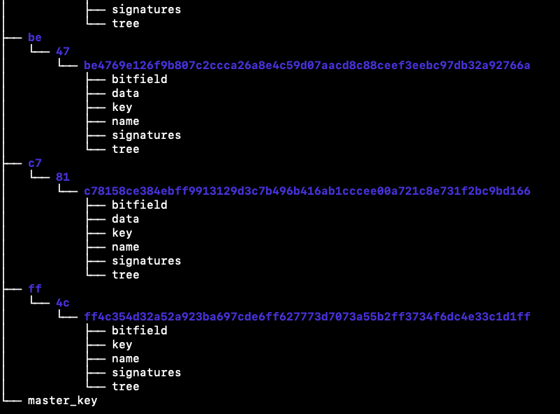

# Datoms协议


Datoms是个人数据资产化协议堆栈中的最底层协议。

```markdown
# datom是最小的可交易数据资产单元

- 数据资产的最小单元是datom。
- 每一个datom都采用append-only log结构，具备很好的底层数据资产治理结构。
- 每一个datom都可以设置对应的权限、隐私保护以及其他安全使用要求。
- 每一个datom都是可交易的。
- 每一个datom都可以单独确权。
- 每一个datom都可以单独计量。
- 每一个datom都可以单独进行权限设置、访问控制。
```

### 1. datom的结构

一个datom是具有如下标准结构的文件集合。通常包括六个文件（datoms v1.2.0版本）：

- 1.1 [bitfield]

  采用bitfield对datom的一些状态进行二进制编码（es6标准，前缀为0b）。

  ```json
  state:
  		{
        var1: fales,
        var2: true,
        var3: false,
      }
  //上述状态用es6的bitfield表示：
  const state = 0b010 
  ```

- 1.2 data

​	   采用wc3 [VCs数据模型][VCs data mode v1.1] 的数据资产。一般包括原始数据，metadata以及（数据控制者）数字签名，可验证。VCs数据模型的结构示意图示例如下：


```json
示例: Alice在JD的消费数据。
1. Alice请求JD，复制其在JD在【2018/1/1-2019/1/1】的个人全部消费数据；
2. JD根据Alice的请求，按照peopledata的规范或行业规范，提供Alice上述数据。
3. 为保证复制到Alice后的数据可信，JD需要生成的数据格式示例如下：
{
  "@context": [         
    "https://www.peopledata.org.cn/2022/data/cusmerdata/v1"   //peopledata拟定的电子商务消费数据规范
  ],   
  
  "id": "metachain DID",  //由metachain分配给Alice的DID.
  
  //metadata
  
  "type": ["cusumer e-commerce data"],   //数据类型
  
  "issuer": "https://www.jd.com/xxxxxxxx",  //数据发布者：JD给Alice在JD的消费数据发布
  
  "issuanceDate": "2022-01-01T19:23:24Z",    //数据发布日期
  
  "rawdata": {                                   //原始数据
    
    "id": "did:jd:ebfeb1f712ebc6f1c276e12ec21",    // 原始数据的DID。
    
    "cusumerdata": {
      "startDate":2018/1/1 ,
      "endDate"": 2019/1/1 ,
      records:{
     //JD 自定义的个人消费数据规范格式的数据。
      	
      “时间”：xxxxx;
      .....
    		
    		
    	 }
    
     }
  
  
  "proof": {  //JD提供的签名proof，证明1）Alice的消费数据以及metadata是JD提供的；2）验证的方法；
    
    "type": "RsaSignature2018",
    
    "created": "2022-01-18T21:19:10Z",
    
    "proofPurpose": "assertionMethod",
    
    "verificationMethod": "https://www.jd.com/issuers/#key-1",
    
    "jws": "eyJhbGciOiJSUzI1NiIsImI2NCI6ZmFsc2UsImNyaXQiOlsiYjY0Il19..TCYt5X
      sITJX1CxPCT8yAV-TVkIEq_PbChOMqsLfRoPsnsgw5WEuts01mq-pQy7UJiN5mgRxD-WUc
      X16dUEMGlv50aqzpqh4Qktb3rk-BuQy72IFLOqV0G_zS245-kronKb78cPN25DGlcTwLtj
      PAYuNzVBAh4vGHSrQyHUdBBPM"
  }

//为防止中间传输过程中出现攻击/泄漏，提供的证明。
"proof": {
    "type": "RsaSignature2018",
    "created": "2022-01-18T21:19:10Z",
    "proofPurpose": "authentication",
    "verificationMethod": "did:JD:ebfeb1f712ebc6f1c276e12ec21#keys-1",
    
    "challenge": "1f44d55f-f161-4938-a659-f8026467f126",
    "domain": "4jt78h47fh47",
    "jws": "eyJhbGciOiJSUzI1NiIsImI2NCI6ZmFsc2UsImNyaXQiOlsiYjY0Il19..kTCYt5
      XsITJX1CxPCT8yAV-TVIw5WEuts01mq-pQy7UJiN5mgREEMGlv50aqzpqh4Qq_PbChOMqs
      LfRoPsnsgxD-WUcX16dUOqV0G_zS245-kronKb78cPktb3rk-BuQy72IFLN25DYuNzVBAh
      4vGHSrQyHUGlcTwLtjPAnKb78"
  }
}
```

对于dataom来说，这个[data]项是其“有效载荷”。

metadata主要来自数据发布者（控制者）,提供metadata主要是对发布的个人数据提供可溯源、可验证的凭证。

proof主要有几种形式：

- 数据发布者数字签名；

```json
数据发布者用自己专用的私钥进行数字签名。并提供验证的方法（methold）。
验证者可以参考数据发布者公开的url，对此签名进行验证。
```

- 中间人数字签名；

```json
流通链条上经过的任何设备、实体的数字签名。
为溯源提供可验证的凭证。
```

- Witness 方签名；

```json
witeness方对任何需要见证的事件进行签名。
```

- 交易签名；

```json
对任何更新、更改事项（状态改变）的签名。
谁做的修改、更新。
```

- ZKP零知识证明【可选】

```json
采用ZKP-SNACK进行的non-interactive的零知识证明。
针对特定场景，需要非交互式的ZKP。
```

- 1.3 key

```json
由一个masterkey生成的private-key.
拥有此key，才能访问datom。
```

- 1.4 secret_key

```json
e2e传输协议[noise]用的key
```

- 1.5 signatures

```json
对数据块的签名
```

- 1.6 tree

```json
对datom的数据块计算merkle tree。并把root hash存储在此。以作为后续审计和验证。
```

- 1.7 [可选项]

  ```json
  可自定义的添加项。
  ```

  

## 2. datoms

若干个datom（最小数据资产块）组合构成datoms。 datoms按照数据资产类别进行分类。可以是同一种类的数据，也可以不是同一类的。

每一个datom的结构如下：

```bash
datom:
- bitfield
- data
- key
- name
- sign
- tree
```

不同datom在一个space中。一个示例:



## 3. 如何使用
```bash
$ npm install datoms
```


## 附录：

- bitfield:<https://emergent.systems/posts/bit-fields/>
- VCs data mode v1.1:<https://www.w3.org/TR/vc-data-model/>


#### 编写人： [jerry.zhang](jerry.zhang.bill@gmail.com)
#### MIT License

