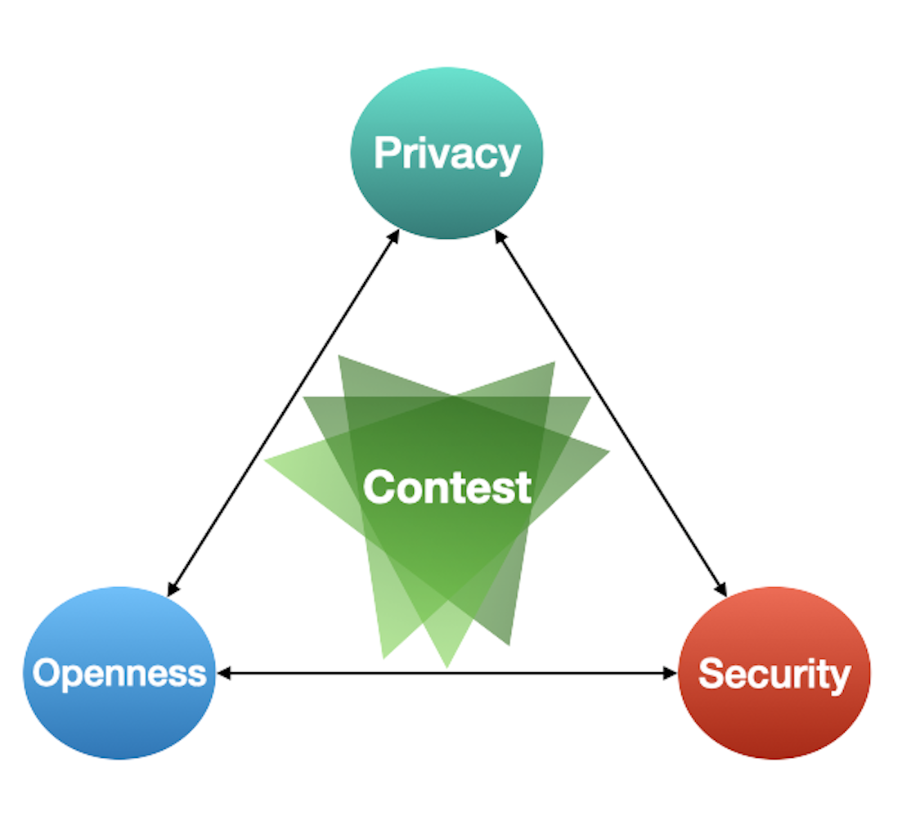
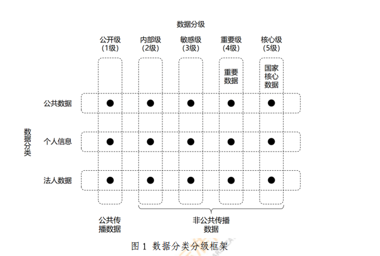
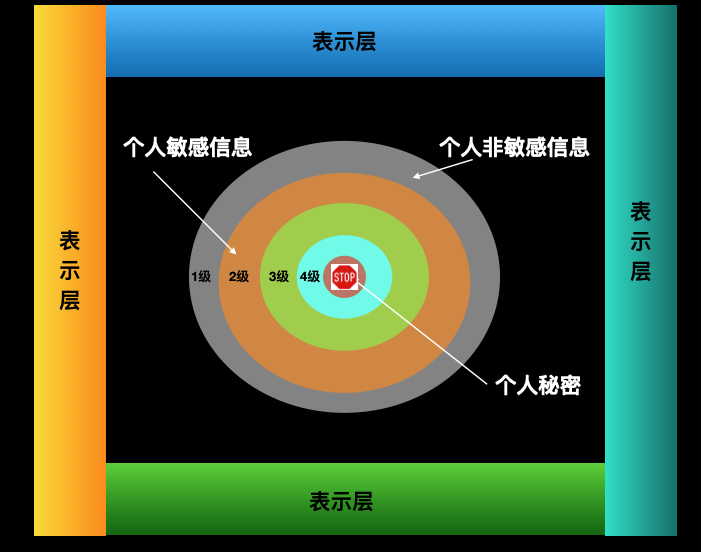
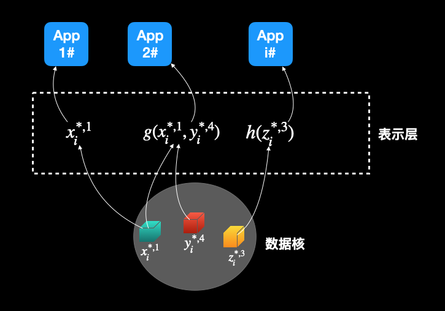

# 个人数据开发利用的“不可能三角”

个人数据的开发利用的一个很核心的原则是“在隐私、安全以及开放"这三个因素构成的“不可能三角”下，基于场景寻求最优解决方案。「数悦坊」是基于此原则的一个解决方案。



## 1. 一些基本概念

### 1.1 个人数据资产分类分级
按照《个人信息保护法》第55、56条的规定，为更好的保护个人信息，需要对个人信息进行分类分级。
《网络安全标准实践指南 - 数据分类分级指引》、《信息安全技术 个人信息安全规范》GB/T35273 -2020、《信息安全技术 个人信息安全影响评估指南》 GB/T 39335-2020 对个人数据分类分级分别做了详细的规定。

##### 数据分类分级总框架



#### 个人信息分类：二级分类
- 一般个人信息
- 敏感个人信息

#### 特定数据最低安全级别
- 敏感个人信息不低于 4 级；
- 一般个人信息不低于 3 级；
- 组织内部员工个人信息不低于2级；
- 个人标签信息不低于2级；

### 1.2 个人数据空间（Personal DataSpace）
**数据空间（DataSpace）**是数据经济中的一个抽象概念。它是数据是一个总称：包括数据模型、数据集、本体、数据分享和专业数据管理服务（即通常由数据中心、存储、储存库单独或在‘数据湖’内提供）的生态系统，以及围绕上述诸元素的治理、政策和业务流程等。

**狭义的数据空间**定义为异构的“数据管理”的抽象，以解决为异构数据集合确定的那些重复的、可复用的数据管理的一般方法，主要包括：搜索和查询、集成、可用性、恢复、访问控制、数据和元数据，以及数据血缘关系。 

**个人数据空间**是数据空间的一个子范畴（sub-category)。PeopleData的个人数据空间是参考[DIKW金字塔](https://en.wikipedia.org/wiki/DIKW_pyramid)的层次结构而构建。

### 1.3 个人数据空间结构
PeopleData（V1.0）采用的个人数据空间结构模型由一个身份ID（Identity）、一个包含五个层级的数据核（PDC：Personal DataCore）和一个数据表示层（PDP: Personal DataPresentations）构成。示意图如下：



- 身份ID标识这个数据空间的主体身份。

- 数据核中包括三大类个人数据：{个人非敏感信息，个人敏感信息，个人秘密}，以及按照分级标准设置的4个分级。其中个人非敏感信息、个人敏感信息按照有关法律和规范定义；个人秘密则指不可访问、不能利用以及其他限制任何外部开发利用的个人信息的统称。

- 数据核包括了个人数据的原始数据，以及描述这些原始数据的metadata。一般的，这些metadata描述了对应的原始数据在哪“出生”，由谁出生的等信息。这些metadata的核心目标是确保数据核中的原始数据是可追溯、可验证的可信数据（TrustedData）。

- 考虑个性化需求、隐私保护、以及权利设置等差异化因素，当外部应用需要访问数据核的数据时，个人可以针对不同的应用，设置不同的策略。

*例如，Alice对其消费数据设置不同的策略：如对提供消费信贷的银行，她可以设置完全使用；对电商或广告商，她则设置为特定期限、特种商品的消费数据可以使用。*

- 这些策略可以看作是一个映射函数（表示类），将数据核的数据映射为某种形态后给外部使用。由于存在很多的策略，所有这些策略构成的集合，就用表示层来描述。外部不能直接访问数据核的数据，而都需要通过表示层来获得数据核中数据的某种形式的一种表示。

由此，对任意一个人具有身份ID的数据空间，其数据核包括三个大类、4个等级的数据；以及在表示层中数量不等的表示类。 

*示例: Alice的个人数据空间的一个截面：*


```html
根据上述模型，一个App应用访问Alice个人数据空间的过程就可以简单的描述如下：
【初始化过程】我们假设Alice已经从不同的数据出生地，运用数据复制权利/可携带权，归集自己的个人数据、并存储在分布式的PDS（个人数据存储）上。除此之外，Alice也完成了对数据空间中的原始数据的访问/使用权限、策略进行设置，并用智能合约的方式表达出来。如，哪些数据可以使用，哪些绝对不行；哪些可以采用隐私计算使用，哪些可以直接用原始数据使用等等。策略设置主要是考虑隐私保护以及限制不良洞察算法滥用数据关联等。
1. 当一个App应用提交Alice要使用她的类别为3、4、5类，安全等级为2、4的所有数据，即的请求。
2. Alice的个人数据空间的代理人（agent）收到这个请求后，首先根据权限、策略设置表，进行审计和评估。
3. 审计和评估后，代理人得出结果：
	a) 当3、5两类、等级为4的数据联合使用，存在隐私风险；因此，拒绝APP对使用；
	b) 第4类、等级为4的数据，必须采用隐私计算保护；同时如果算法不合格，则拒绝使用。
4. APP提交了处理{}数据的算法和，代理人对算法进行审计或验证后，通过了。
5. 最终，APP得到的数据和可以使用的算法。
```


	
## 2. OPS-C模型

**O**：开放性；**P**：隐私；**S**: 安全 ; **C**：场景

某一个特定的场景**C**可以用其对个人数据的三个属性，即"开放、隐私和安全"的不同要求进行度量（以下简称：“**OPS-C度量**”）。

```html
OPS度量：是一种定性加定量结合的方式，对一个数据开发利用场景对于个人数据的三个属性的不同要去而进行的度量。

OPS-C模型： OPS度量是一个向量,所有场景的OPS度量构成一个向量空间。这个向量空间存在最优解。
```

假设**O**,**P**,**S**的取值区间为[0,1]，那么三种场景的度量可以表示为：
**C[i]**=[0.1, 0.5,0.2],**C[j]**=[0.8, 0.1,0.4],**C[k]**=[0.2, 0.2,0.2]

虽然在实际应用中，很难对某个场景的上述度量进行定量的测算。但可以通过一些定性和定量结合的方式来测度。例如，数据安全性设定为5个级别。


**OPS-C模型**是个人数据开发利用新范式的一个基础模型，旨在明确个人数据开发利用过程中需要始终兼顾的原则，并让市场参与各方形成共识。

**OPS-C模型**将基于不同的场景来构建最优的解决方案。例如，同意是需要用到个人消费数据的两个场景，其**OPS-C度量是不一样的**：

```json
例子：
拟开发利用的个人数据类型：个人消费数据。
1. 场景A：消费信贷 
	OPS-C模型:{
		开放： 全部消费数据；
    隐私： 不披露具体购买的商品品牌、型号、规格等；
    安全： 采用隐私计算使用数据；仅对持牌金融机构申请消费信贷场景下开放
	}

场景B：JD促销
	OPS-C模型：{
    开放： 全部消费数据；
    隐私： 披露具体购买的商品品牌、型号、规格，但不披露价格、消费金融等；
    安全： 采用隐私计算使用数据；仅对JD推送促销获得场景开放；
  }

```

## 
