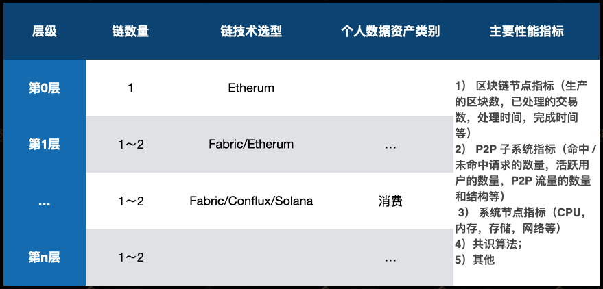

# 元链 - metachain

MetaChain（元链）是一个联盟区块链，是个人数据流通、数据资产交易的主链。

## 1. 概述

### 1.1 元链的示意图如下：


元链由4个创世根节点、12～17个创始根节点组成：

- **创世节点**：创世节点是元链上的初始节点，是启动元链运行的初始节点。创世节点数量为4+1个，其中4个由创世成员单位负责投资和运营，1个由peopledata执行机构（秘书处）负责运营和维护。运行创世节点的机构为创世成员，拥有平等的投票权和分红权，并且在初始时获得两亿（200,000,000.00）个积分。积分的单位符号为DAT。积分的数量与后续的投票权和分红权直接相关，积分会因为创世成员的违规行为或者忠诚行为而相应的增加或者减少。每位成员在起始时拥有平等的20%的投票权和分红权，积分每减少一千万，权利份额减少1%。积分具体的增加或者减少规则见《创世协议章程》。
- **创始节点**：创始节点是元链上除创世节点之外的节点，创始节点也有数量限制，原则上不超过17个。

### 1.2 元链的架构

元链的架构示意图如下：


元链的技术架构采用的核心原则是：

- 一链一事

元链是多链、分层架构。每一条链从事特定的一类数据资产的交易、存证。

```markdown
# 个人数据资产类别多样，交易和存证的要求也有很大的不同。
例如：当一个需求需要使用身份数据、消费数据和证券交易数据。这三类数据资产存在很大的差异。
- 身份数据。基本为静态数据，很长时间内不要更新、也不会变化。使用场景大多是查询，验证，同时需要很快的处理速度。
- 消费数据。是动态数据，更新频率一般为天。使用场景大多是批处理，训练模型。不需要很快的处理速度。
- 证券交易数据。是动态数据，更新频率很高，可以到秒。使用场景复杂多变，既有批处理、也有单笔查验。需要的处理速度有快有慢。
# 提高效率和互操作性
元链为上述每一类数据资产设设置一条链，即“一链一事”的原则。这样可以采用统一的标准，提高效率和互操作性。
# 最优链
区块链有多种，可以根据不同数据资产类别的要求，来选择和定义区块链的技术要求以及规范。从而实现最优。
```

- 跨链用桥

由于元链是多链、多层架构，同时存在同构、异构链。不同链之间的交互采用链桥。

链桥的优点是在区块形成后进行互操作，而不是在区块形成前、形成中进行。

链桥的技术架构参考**《元链链桥技术规范》**。

- 治理用币

元链采用授权节点用积分（币）投票的形式进行治理。具体参考**《元链积分使用规则》**。

## 2. 元链的治理

元链的治理和运营都由peopledata的创世成员设立的委员会拟定政策和制度，并委托执行机构（秘书处）负责具体治理和运营的实施、监督。

### 2.1 制度委员会

PeopleData设立制度委员会进行重大事项决策和长期运营规划。制度委员会由五位创世成员共同成员，积分的数量与投票权的多少直接相关。设立之初每位成员的投票权相同，均为20%。制度委员会决定以下事项：

1、决定PeopleData的盈利模式；

2、决定PeopleData运营方向和时长；

3、决定分红期间与可用于分红的数额；

4、决定创世成员奖赏、惩罚和退出机制；

5、决定创始节点加入、退出等管理机制；

6、制定对PeopleData生态参与人的管理及审核制度

7、制定数据服务提供商等其他接入PeopleData生态的授权制度

8、其他应由制度委员会决定的事项。

### 2.2 技术委员会

技术委员会仍然由创世节点成员组成，每位创世成员在起始拥有同等的投票权。投票权根据积分的数量变化而变化。技术委员会主要负责技术路线和核心及技术相关事项，指导PeopleData发展的技术方向。技术委员会主要决定以下事项：

1、负责确定技术路线与核心技术发展规划;

2、负责相关技术预研，开展重点技术难题攻坚; 

3、构建技术交流平台和社区，以及维护、开发开源项目。

###  2.3 标准委员会

标准委员会由创世节点和创始节点成员组成，负责制定和宣传PeopleData发展所需要的数据系列标准。具体的，标准委员会应当制定以下标准：

1、数据存储标准；

2、数据模型标准；

3、通信标准；

4、算法质量安全标准；

5、数据钱包标准；

6、算法执行环境标准；

7、电子签名标准；

8、其他必要标准。

###  2.4 执行机构（秘书处）

1、PeopleData设立执行机构，负责PeopleData日常的运营、管理、决策执行。

2、执行机构由数悦铭金负责。

3、执行机构的资金来源于：

1. 创世成员的投入资金；
2. 创始成员缴纳的资金；
3. 向其他参与人收取的费用；
4. 每年抽取的税后利润总额的30%。

4、执行机构应当以PeopleData整体利益做为运行出发点，管理第3条所列资金。

## 3. 元链的各个组成部分

元链主要包括以下组成部分：

### 3.1 主网节点：

元链的联盟成员的节点构成主网节点。主网节点分为5个创世节点，12-17个创始节点。每个节点配置应该满足**《元链节点技术要求规范》**的数据中心及相应的基础设施。

- 创世节点数据中心
- 创始节点数据中心

### 3.2 按层分类的子链

元链按照个人数据资产类别的交易，划分为若干层。每层设置1～2个子链。子链采用同构或异构链，并根据该层对应的需求配置对应的子链。



子链的技术选型，按照个人数据资产类别以及主要性能指标要求从开源项目中选择，并适当的做一些开发和修改。

### 3.3 链桥

链桥（ChainBridge）是不同层级的子链之间的进行互操作的方法。

详细情况参见《元链链桥技术规范》

### 3.4 积分（治理币）

元链的治理均采用投票方式进行。治理的所有事项均按照如下的流程进行：

- 合格成员提交提案初稿
- 委员会初审：提案形式审查
- 委员会复审：提案事项的分解，形成待表决事项
- 提交提案（附待表决事项）
- 投票表决
- 提案执行
- 提案履行情况首次报告
- 委员会监督报告

